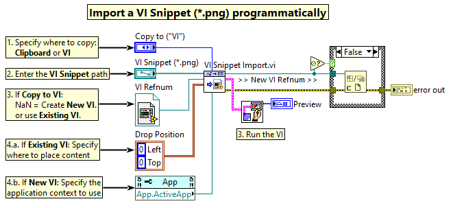
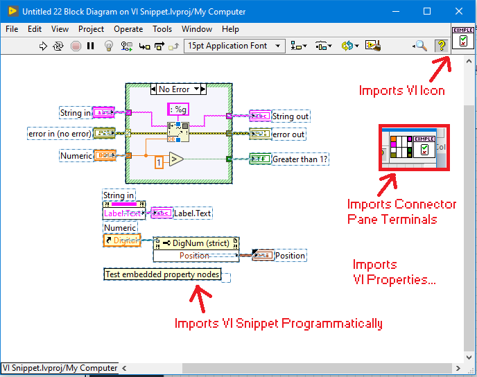
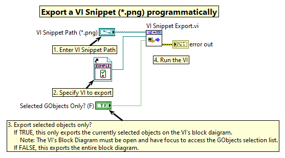

# labview_snippet
VI Snippet (\*.png) Import and Export Library for LabVIEW

Import or export a VI Snippet (\*.png) image programmatically using pure
LabVIEW code (No external dlls or dependencies).

## Releases
This library is released as a Zip File (\*.zip) or Packed Library (\*.lvlibp).

| Release | Version |
| --- | --- |
| [VI Snippet.lvlibp](https://github.com/rcpacini/labview_snippet/raw/master/releases/VI%20Snippet.lvlibp) | 0.1.0 |
| [VI Snippet Source.zip](https://github.com/rcpacini/labview_snippet/raw/master/releases/vi_snippet_src.zip) | 0.1.0 |

## What's a VI Snippet?
[VI Snippets](http://www.ni.com/tutorial/9330/en/) are PNG image (\*.png)
embedded with LabVIEW code to solve the copy-and-paste (or drag-and-drop)
dilemma with graphical programming. Introduced in 2014, VI Snippets provide
a human readable view of code fragments, similar to what you see on
stack exchange, that can be imported into the LabVIEW Development
Environment.

VI Snippet images (like the one below) are dropped onto a VI's Block
Diagram to copy the code snippet into the LabVIEW environment.

Over 6 years have passed and NI has yet to include a
[VI Snippet API](http://www.ni.com/tutorial/9330/en/)
so I built one myself...

## Features
In addition to supporting the basic VI Snippet drag-and-drop capabilities,
this library can also:
- Copy Front Panel objects to their original positions
- Wire the connector pane terminals
- Update the VI Icon
- Clone the VI Properties
- ***COMMING SOON:*** Embed SubVIs

## Import a VI Snippet (\*.png)
Open the `src/Examples/Example Import.vi`, enter the **VI Snippet Path (\*.png)**
and run the VI to import the VI Snippet into a new VI:

Pastes this VI Snippet (i.e. `src/Images/example.png`):

Programmatically into a new *or existing* VI:

If an existing VI reference is wired to the `VI Snippet Import.vi`, use the
**Drop Position** to specify where on the Block Diagram to paste the code.
New VI's ignore the Drop Position parameter.

*Note: Only new VI's will copy the connector terminals, icon and VI
properties.*

## Export a VI Snippet (\*.png)
Open the `src/Examples/Example Export.vi`, enter the
**VI Snippet Path (\*.png)** and run the VI to export the VI content
as a VI Snippet image.

Exports the VI `src/Examples/Example Sample Snippet.vi` as a VI Snippet PNG
Image:

Set **Selected GObjects Only?** to True to only export the selected
diagram objects within the wired VI reference.

*Note: The VI's block diagram
must be open and active focus in order to get the selected GObjects.
Otherwise this will raise error 1055: Invalid object reference.*

## Examples
More VI Snippet (\*.png) images can be found in the **src/Images** folder.

## Additional Information
VI Snippets (\*.png) are no more than PNG files with a custom PNG chunk
type called `niVI` which embed the binary VI.

*Note: This library uses VI Scripting to make a selection of all block diagram
objects (i.e. decorations, nodes, sub VIs, wires, etc.) and copies the
GObjects to the clipboard in the context of the block diagram.
This is a workaround due to the inconsistent nature of the
"Place object on cursor" IDE method.*

### VI Snippet PNG Chunks

| Type | Description |
| --- | --- |
| `IHDR` | PNG header information |
| `IDAT` | PNG image data |
| **`niVI`** | **LabVIEW VI code** << this is the secret sauce E.g. `RSRC...VI_NAME.vi` |
| **`tEXt`** | **LabVIEW VI Snippet help text** E.g. `National Instruments Software This image contains an embedded VI File. For more details visit ni.com/info and enter 'ex6a7h'` |
| `IEND` | PNG end of file |

## Build Specifications
To rebuilt the VI Snippet Packed Library, open the **src/VI Snippet.lvproj**,
right-click the **VI Snippet API Library** and select **Build**.

The Packed Library (\*.lvlibp) is output to `releases/VI Snippet.lvlibp`

*Note: This library was built and tested with LabVIEW 2019.*

## Contribution
Feedback is welcome, submit a ticket for bug fixes or feature requests.

Cheers,
Ryan
