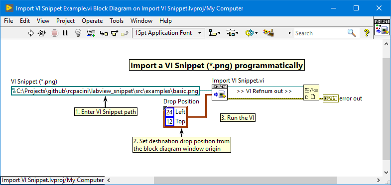
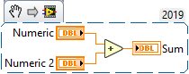
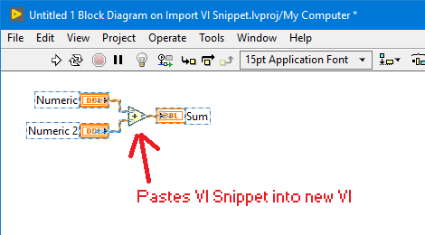

# labview_snippet
VI Snippet (\*.png) Image Import Library for LabVIEW

NI has yet to include a [VI Snippet](http://www.ni.com/tutorial/9330/en/) API for LabVIEW so I created my own. 
This library imports VI Snippet PNG images using the clipboard and pastes
the code to the specified VI's block diagram (or creates a new VI if Not a Refnum).

This library was tested with LabVIEW 2019.

## Gettings Started
Open the **Import VI Snippet.vi**, select the **VI Snippet Path (\*.png)** and run
the VI to import the VI Snippet to a new VI.

Pastes this:

Into a new VI:

## Examples
More VI Snippet (\*.png) examples can be found in the **src/Import VI Snippet.lvproj** LabVIEW project.

## Under the Hood
VI Snippets (\*.png) are no more than PNG files with a custom chunk 
type called "niVI" which contains the binary VI itself. 

Under the hood, this library does the following:
1. Read the VI Snippet PNG chunks
2. Save the "niVI" data chunk to a temporary VI file (\*.vi)
3. Load the temporary VI using VI Server
4. Copy all Block Diagram content to the clipboard (See below)
5. Paste the content to the destination block diagram
6. Delete the temporary VI.

*Note: This uses VI Scripting to make a selection of all block diagram
objects (i.e. decorations, nodes, sub VIs, wires, etc.) and copys the 
GObjects to the clipboard in the context of the block diagram.
This is a workarround due to the inconsistent nature of the
"Place object on cursor" IDE method.*

## Build Specifications
To rebuilt the llb, open the **src/Import VI Snippet.lvproj**, right-click 
the **import_vi_snippet_source** and select **Build**.

## Contribution
Feedback is welcome, submit a ticket for bug fixes or feature requests.

Cheers,
Ryan
